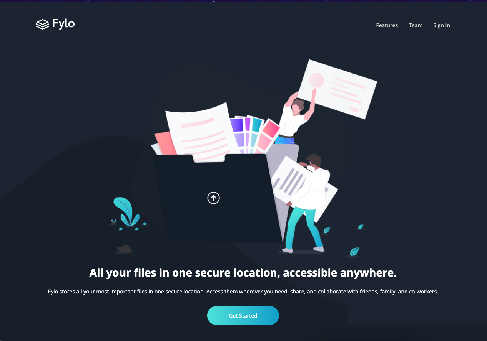

# Frontend Mentor - Fylo dark theme landing page solution

This is a solution to the [Fylo dark theme landing page challenge on Frontend Mentor](https://www.frontendmentor.io/challenges/fylo-dark-theme-landing-page-5ca5f2d21e82137ec91a50fd). Frontend Mentor challenges help you improve your coding skills by building realistic projects. 

Live Link/Github link [here] (https://eclecticowl.github.io/fylo-dark-theme/)

## Table of contents

- [Overview](#overview)
  - [The challenge](#the-challenge)
  - [Screenshot](#screenshot)
- [My process](#my-process)
  - [Built with](#built-with)
  - [What I learned](#what-i-learned)

## Overview

### The challenge

Users should be able to:

- View the optimal layout for the site depending on their device's screen size
- See hover states for all interactive elements on the page

### Screenshot

## My process

I decided to go with a mobile first approach for this challenge. I also decided to break the components down by section and style while creating them (header, main, footer). This process seemed to help both mentally and seemed to save a few hours.

### Built with
- SASS
- HTML

### What I learned

I have started using more utility classes in order to save time. I tend to use flex a lot, so using a utility class saves time in writing the same code, over and over again.
